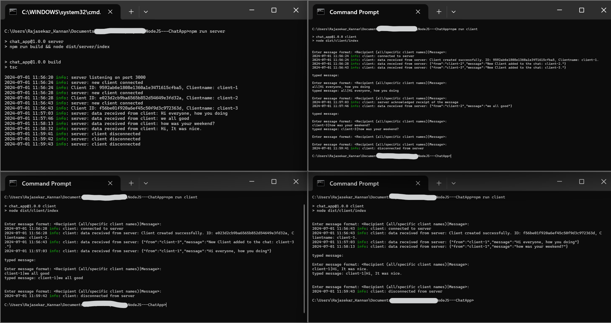

# NodeJS---ChatApp
A chat application using the net library enables real-time text communication by establishing TCP connections between clients and a server. It ensures seamless message exchange and user interaction over a reliable network protocol

## Features

- Real-time messaging between clients and server.
- Client management on the server side.

## Folder Structure

<pre>
.
├── README.md
├── package-lock.json
├── package.json
├── .env-example
├── .env
├── src
│   ├── client
│   │   ├── client.ts
│   │   └── index.ts
│   ├── server
│   │   ├── clientManager.ts
│   │   ├── index.ts
│   │   ├── interface.ts
│   │   └── server.ts
│   └── utils
│       ├── index.ts
│       └── logger.ts
└── tsconfig.json
</pre>

## Installation

To get started with this repository, follow these steps:

1. Switch to the root directory of the repository.
2. create .env file from coping .env-example and made changes.
3. Run `npm install` to install dependencies.
4. Run `npm run server` to run server.
5. Open new terminal or tab and Run `npm run client` to run client 1.
6. Open new terminal or tab and Run `npm run client` to run client 2.
7. We can create n number of clients

## Client Management and Messaging

- Client Addition: When a new client joins, a unique ID and username are generated and assigned. Other clients are promptly notified of the new addition.
- Messaging Flexibility: Clients can send messages to multiple recipients simultaneously or individually, facilitating versatile communication.
Feel free to explore the code and tests to understand different data structures and algorithms.

